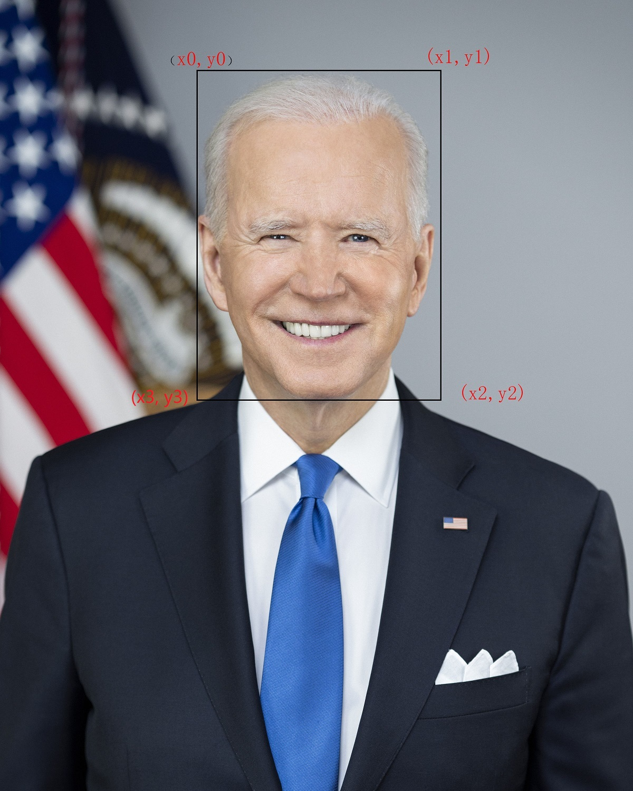

##  NVIDIA 2D Image Performance Primitives (NPP) Demo

	本仓库是[NVIDIA NPP](https://docs.nvidia.com/cuda/npp/group__nppi.html)的简单demo，例如：affine transform，normalize((x - u) * s), bgr2rgb, hwc2chw.你可以结合本仓以及NVIDIA NPP的官方文档进行更多操作


## NVIDIA NPP的官方文档

1. [NPP Image Processing:]( https://docs.nvidia.com/cuda/npp/group__nppi.html)

2. [Image-Processing Specific API Conventions](https://docs.nvidia.com/cuda/npp/nppi_conventions_lb.html)，其中包括命名规范：

- Function Naming

```shell
Image processing related functions use a number of suffixes to indicate various different flavors of a primitive beyond just different data types. The flavor suffix uses the following abbreviations:
```

- "A" if the image is a 4 channel image this indicates the result alpha channel is not affected by the primitive.

- "Cn" the image consists of n channel packed pixels, where n can be 1, 2, 3 or 4.

- "Pn" the image consists of n separate image planes, where n can be 1, 2, 3 or 4.

- "C" (following the channel information) indicates that the primitive only operates on one of the color channels, the "channel-of-interest". All other output channels are not affected by the primitive.

- "I" indicates that the primitive works "in-place". In this case the image-data pointer is usually named pSrcDst to indicate that the image data serves as source and destination at the same time.

- "M" indicates "masked operation". These types of primitives have an additional "mask image" as as input. Each pixel in the destination image corresponds to a pixel in the mask image. Only pixels with a corresponding non-zero mask pixel are being processed.

- "R" indicates the primitive operates only on a rectangular "region-of-interest" or "ROI". All ROI primitives take an additional input parameter of type NppiSize, which specifies the width and height of the rectangular region that the primitive should process. For details on how primitives operate on ROIs see: Region-of-Interest (ROI).

- "Sfs" indicates the result values are processed by fixed scaling and saturation before they're written out.

```shell
The suffixes above always appear in alphabetical order. E.g. a 4 channel primitive not affecting the alpha channel with masked operation, in place and with scaling/saturation and ROI would have the postfix: "AC4IMRSfs".
```

## 具体例子：

下面展示的是`crop_and_resize_with_affine_transform`

- 图像信息:

```shell
image:
       __|<++++++++++++src_width+++++++++++>|
         +-----------------------------------
         +-----------------------------------
         +----(x0,y0)*************(x1,y1)----
         +----***************************----
         +----***************************----
         +----***************************----
   src   +----************roi************----
 height  +----***************************----
         +----***************************----
         +----***************************----
         +----***************************----
         +----(x3,y3)************(x2,y2)-----
         +-----------------------------------
       __+-----------------------------------
```

- 等比例缩放(isFixResize=1, isSymmetryPad=0):

```shell
roi_height > roi_width                roi_height < roi_width
****************000000                ********************
****************000000                ********************
****************000000                ********************
****************000000                ********************
****************000000                ********************
****************000000                ********************
****************000000                ********************
****************000000                00000000000000000000
****************000000                00000000000000000000
****************000000                00000000000000000000
```

- 等比例缩放(isFixResize=1, isSymmetryPad=1):

```shell
roi_height > roi_width                roi_height < roi_width
000****************000                00000000000000000000
000****************000                00000000000000000000
000****************000                ********************
000****************000                ********************
000****************000                ********************
000****************000                ********************
000****************000                ********************
000****************000                ********************
000****************000                00000000000000000000
000****************000                00000000000000000000
```

- 原图




```shell
face_roi_xywh = [374, 132, 462, 624]
```

- 编译并运行demo


```shell
# 软件环境：
# Ubuntu 18.04 
# CUDA 11.x 
# OpenCV 3.X 
############编译############
>>chmod a+x build_npp_demo.sh
>>./build_npp_demo.sh /usr/local/cuda
############运行############
>>chmod a+x run_demo.sh
>>./run_demo.sh
>>

############运行Python############
>>python crop_resize_normalize_bgr2rgb_hwc2chw.py

```

- dei_size=[640, 640], isFixResize = 0, isSymmetryPad = 0, roi_xywh = None


- dei_size=[640, 640], isFixResize = 0, isSymmetryPad = 0, roi_xywh = [374, 132, 462, 624]


- dei_size=[640, 640], isFixResize = 1, isSymmetryPad = 0, roi_xywh = None


- dei_size=[640, 640], isFixResize = 1, isSymmetryPad = 0, roi_xywh = [374, 132, 462, 624]


- dei_size=[640, 640], isFixResize = 1, isSymmetryPad = 1, roi_xywh = None


- dei_size=[640, 640], isFixResize = 1, isSymmetryPad = 1, roi_xywh = [374, 132, 462, 624]


## NVIDIA NPP常用函数代码片段(详细使用方法请参考源码`npp_demo.cpp`)

- NVIDIA NPP—getAffineTransform

```cpp
NppiRect oSrcROI = {.x=roi_x, .y=roi_y, .width=roi_width, .height=roi_height};
double aQuad[4][2] = {{0, 0.0}, {1.0 * des_width, 0.0},
                          {1.0 * des_width, 1.0 * des_height},
                          {0.0, 1.0 * des_height}};
double aCoeffs[2][3];
nppiGetAffineTransform(oSrcROI, aQuad, aCoeffs);
```

- NVIDIA NPP—warpAffine

```cpp
nppiWarpAffine_8u_C3R(src_ptr_d, {src_width, src_height},
                      sizeof(Npp8u) * src_width * src_channels,
                      {0, 0, src_width, src_height},
                      dst_ptr_d, sizeof(Npp8u) * des_width * src_channels,
                      {0, 0, des_width, des_height},
                      aCoeffs,
                      NPPI_INTER_LINEAR);
```

- NVIDIA NPP—bgr2rgb

```cpp
const int aDstOrder[3] = {2, 1, 0};
nppiSwapChannels_8u_C3IR(dst_ptr_d,
        sizeof(Npp8u) * des_width * src_channels,
        {des_width, des_height},
        aDstOrder);
```

  

- NVIDIA NPP—uint8 -> float

```cpp
nppiConvert_8u32f_C3R(dst_ptr_d, 
                    sizeof(Npp8u) * des_width * src_channels,
                    dst_float_ptr_d,
                    sizeof(Npp32f) * des_width * src_channels,
                    {des_width, des_height});
```

- NVIDIA NPP—(x - a) / b

```cpp
/*1.-------- y = (x - a) --------*/
const Npp32f means[3] = {0.0f, 0.0f, 0.0f};
nppiSubC_32f_C3IR(means, dst_float_ptr_d, sizeof(Npp32f) * des_width * src_channels, {des_width, des_height});

/*2.---------- y * s ----------*/
const Npp32f scales[3] = {0.00392157f, 0.00392157f, 0.00392157f};
nppiMulC_32f_C3IR(scales, dst_float_ptr_d, sizeof(Npp32f) * des_width * src_channels, {des_width, des_height});
```

- NVIDIA NPP — hwc2chw

```cpp
Npp32f * const aDst[3] = {dst_chw_float_ptr_d,
                    dst_chw_float_ptr_d + des_width * des_height,
                    dst_chw_float_ptr_d + 2 * des_width * des_height};
nppiCopy_32f_C3P3R(dst_float_ptr_d,
                sizeof(Npp32f) * des_width * src_channels,
                aDst,
                sizeof(Npp32f) * des_width,
                {des_width, des_height});
```